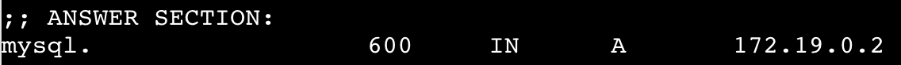

# Docker Compose Hands-on

In the workshop, we talked about creating a basic multi-service application. But, the final compose file wasn't _quite_ ready to run an application. While both the app and database would launch, there's no app code to connect to it and the application doesn't have the necessary dependencies installed to use MySQL. So, let's fix all of this!

## Setup

1. In a new PWD instance, clone this repo:

    ```
    git clone https://github.com/mikesir87/dceu-2018-workshop.git
    cd dceu-2018-workshop
    ```

    We will be using this as the starting point for our workshop.

## Replacing the App Image

As mentioned in the overview, the base `php:7-apache` image doesn't have the necessary MySQL extensions installed. To fix this, we will create our own image and update our compose file to use it!

1. In the workshop directory, create a new `Dockerfile`. In it, place the following:

    ```
    FROM php:7-apache
    RUN docker-php-ext-install mysqli
    ```

    The `php` image includes a few helper scripts to install extensions. We're simply using that script to install the extension.

2. Update the compose file to use this image to add the `build` instruction:

    ```
    services:
      app:
        build: ./
    ```

    The `build` instruction tells Compose to build an image using the Dockerfile found in the current directory (`./`) and then use that as the image.

3. Remove the `image` declaration from the `app` service.

4. Now, if you run `docker-compose up -d`, you should see an image be created and the application attempt to start. If we run the app, we get an error indicating:

> Connection failed: No such file or directory


## Connecting to the Database

If you look in the `src/index.php` file, you'll see some connection details at the top of the file. In order for the app to work, we need to get an actual connection to the database.

When Docker starts a container, it makes itself the DNS resolver for all requests (DNS is used to lookup an IP address for a hostname). While many applications may connect to a database using an IP address, DNS is a _fantastic_ way to do service discovery (finding out where things are).

1. Let's get into the PHP container and see if it can find the database.

   ```
   docker exec -ti 3-docker-compose_app_1 bash

   # Now, you have a bash inside the container. Let's install dig
   apt update && apt install dnsutils

   dig mysql
   ```

   What you should is an `A` record returned that shows the name `mysql` resolving to an IP address. It may case, it resolved to `172.19.0.2` (see below).

   

2. Let's verify that that is indeed the IP address for the container. First, we have to drop out of our container and get back on to the host.

    ```
    exit
    ```

    You should now see a prompt simply starting with `$`.

3. Let's look at the MySQL container and see what IP address it was given.

   ```
   docker container inspect 3-docker-compose_mysql_1
   ```

   This is pretty overwhelming, but it shows _all_ details for a container. If we look through the JSON, we'll see `NetworkSettings` -> `Networks` -> `3-compose-file` -> `IPAddress` is the same as what we saw in our `dig` command. Cool!

   A simpler way to get the IP address is using "filters" on the result

   ```
   docker container inspect 3-docker-compose_mysql_1 -f '{{range .NetworkSettings.Networks}}{{.IPAddress}}{{end}}'
   ```

4. Now that we know the hostname for sure, let's update the `index.php` file.

   ```
   $DB_HOST = 'mysql';
   ```

5. Open up the app and you should now see the current time, as reported by the database!


## Wrap-up

In this hands-on, we updated the compose file to use a custom image, rather than an image directly from Docker Hub. We then looked a little bit into container network and service discovery using DNS. And, finally, we got our app working.

Hooray!
